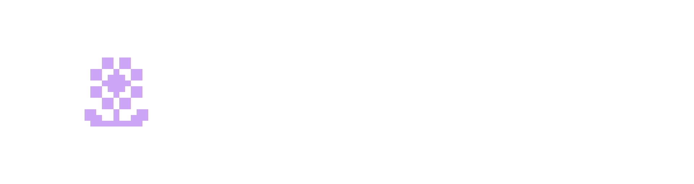

<div align="center">

  

  # Cluster Loaders (`cluster-loaders`)

  **Physics-Driven, Dither Shaders & Parametric Loaders for React**

  [Documentation](https://fs-cluster-docs.vercel.app) | [NPM Package](https://www.npmjs.com/package/cluster-loaders) | [Torus Founding Space](https://torusfoundingspace.com)

  [](https://www.npmjs.com/package/cluster-loaders)
  [](../../LICENSE)

</div>

---

## Overview

A lightweight, zero-dependency collection of continuous parametric loaders — mathematical curves, fluid dynamics, standing waves, stochastic noise, Bayer matrix dithering, and 3D projections — rendered in high-performance SVG and HTML5 Canvas.

---

## Installation

### NPM
```bash
npm install cluster-loaders
```

### CLI Component Installer (shadcn style)
```bash
npx cluster-loaders add astroid
```

---

## Usage

```tsx
import React from 'react';
import { CurveLoader, curves } from 'cluster-loaders';

export default function LoadingState() {
  const astroid = curves.find(c => c.name === "Astroid");

  return (
    <div className="w-24 h-24 text-purple-400">
      <CurveLoader config={astroid} />
    </div>
  );
}
```

---

## Contributing

This package is open source. Pull requests and feature contributions are welcome.

1. Fork and clone the repository.
2. Run `npm install`.
3. Add custom curves or canvas loaders under `src/`.
4. Open a Pull Request.

---

## Torus Founding Space

If starting your own company or joining a startup as a founding member is your ultimate goal, apply at [torusfoundingspace.com](https://torusfoundingspace.com). Membership is 100% free.

---

## License

Distributed under the MIT License.
